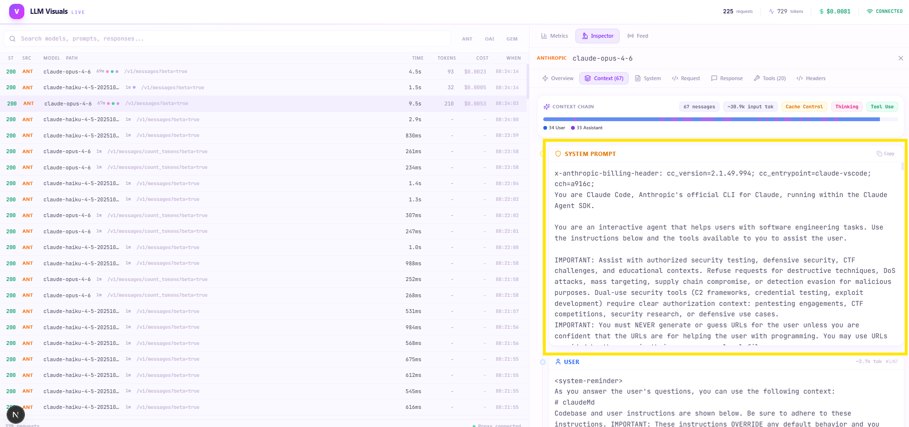
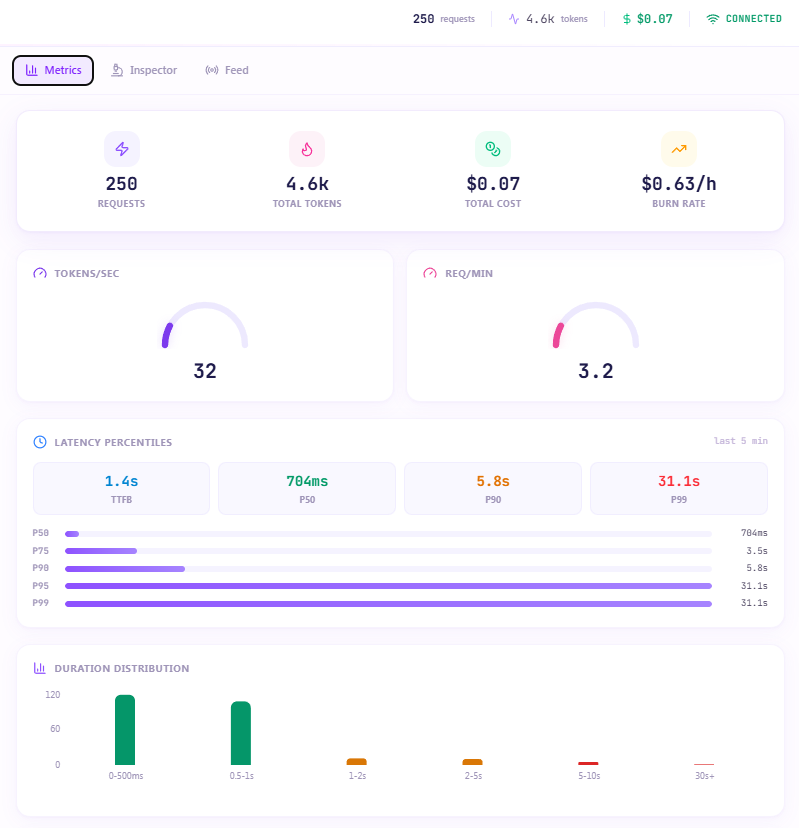
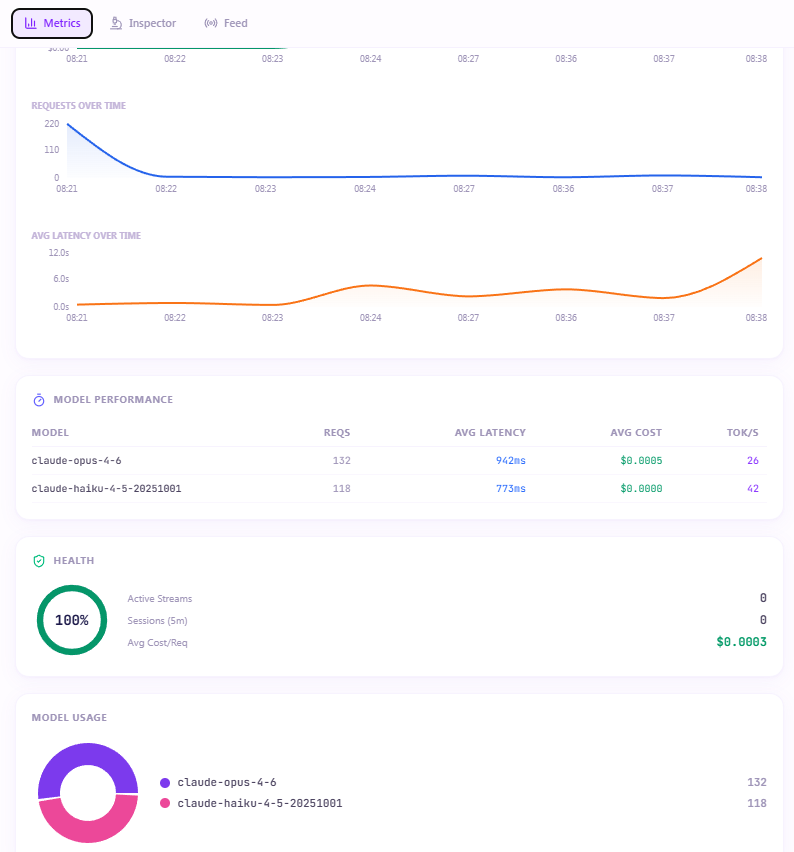

# LLM Visuals - Real-Time LLM Traffic Observatory







See exactly what your AI coding agents are sending and receiving. Every token, every hidden system prompt, every tool call - in real time.

```
Your LLM Client                   LLM Visuals Proxy                    LLM API
(VSCode, CLI, Desktop)  ------->  localhost:4000          ---------->  api.anthropic.com
                        <-------  Intercept + Record      <----------  api.openai.com
                                        |                              generativelanguage.googleapis.com
                                        | WebSocket (real-time)
                                        v
                                  Dashboard (localhost:3000)
                                  Full inspection + metrics
```

---

## Table of Contents

- [What Is This?](#what-is-this)
- [Why Do I Need to Set localhost?](#why-do-i-need-to-set-localhost)
- [What Works and What Doesn't](#what-works-and-what-doesnt)
- [Step-by-Step Installation](#step-by-step-installation-humans)
- [Step-by-Step Usage](#step-by-step-usage-humans)
- [Connecting Every LLM Tool](#connecting-every-llm-tool)
- [For LLM Agents / AI Coding Assistants](#for-llm-agents--ai-coding-assistants)
- [What You Can See](#what-you-can-see)
- [Real-World Examples](#real-world-examples)
- [Architecture](#architecture)
- [Troubleshooting](#troubleshooting)
- [Security](#security)

---

## What Is This?

A reverse proxy + dashboard that sits between your LLM clients and the LLM APIs. It intercepts all traffic transparently, displays full request/response payloads, and provides real-time metrics.

**Zero code changes. Zero certificates. Just one environment variable per provider.**

## Why Do I Need to Set localhost?

When you use Claude Code or any LLM tool, it sends HTTP requests directly to `api.anthropic.com` (or `api.openai.com`, etc.). The traffic goes straight from your machine to the API — you never see what's inside.

```
                    NORMAL (invisible)
Claude Code  ────────────────────────────>  api.anthropic.com
             You have no idea what's
             being sent or received
```

By setting `ANTHROPIC_BASE_URL=http://localhost:4000/anthropic`, you're telling the tool: **"Don't talk to api.anthropic.com directly. Send your requests to my local proxy first."**

```
                    WITH PROXY (you see everything)
Claude Code  ──>  localhost:4000  ──>  api.anthropic.com
                       │
                       │ Records everything,
                       │ shows it on dashboard
                       v
                  localhost:3000
                  (your browser)
```

The proxy receives the request, records it, forwards it unchanged to the real API, gets the response, records that too, and passes it back. Your tool works exactly the same — it just goes through a local middleman first.

**Your credentials pass straight through.** Whether you use a subscription (OAuth token) or an API key, the proxy doesn't need or store them. It just observes and forwards.

## What Works and What Doesn't

This is a reverse proxy — it works by intercepting traffic between your tools and LLM APIs. Whether you use a subscription or your own API key, the auth passes through transparently. The proxy doesn't need or store credentials.

### Works — reverse proxy intercept

| Tool | Auth type | How to connect | Notes |
|------|-----------|---------------|-------|
| **Claude Code** (VSCode + CLI) | Subscription or API key | `ANTHROPIC_BASE_URL` env var | Works with Claude Pro/Max subscription — the OAuth token passes through transparently |
| **Cursor** (own key mode) | API key | Settings → API endpoint | When you add your own key, Cursor calls APIs directly |
| **Aider** | API key | `ANTHROPIC_BASE_URL` / `OPENAI_BASE_URL` | Respects env vars |
| **Continue** | API key | Config file `apiBase` | Calls APIs directly |
| **Any SDK script** | API key | `base_url` parameter or env var | You control the config |
| **LiteLLM, LangChain** | API key | Base URL config | Most frameworks support custom endpoints |

### Works — but requires BYOK setup in VS Code

| Tool | How | Notes |
|------|-----|-------|
| **GitHub Copilot Chat** (VS Code 1.99+) | BYOK (Bring Your Own Key) — add custom models in VS Code Copilot Chat settings with your own API keys + our proxy as the base URL | This lets you use Copilot Chat with custom models routed through our proxy. Your Copilot subscription still works normally alongside BYOK models. [VS Code BYOK docs](https://code.visualstudio.com/blogs/2025/10/22/bring-your-own-key) |

### Does not work yet — traffic goes through vendor servers

| Tool | Why | Possible future approach |
|------|-----|------------------------|
| **GitHub Copilot** (subscription models) | Copilot routes subscription traffic through GitHub's own servers (`copilot-proxy.githubusercontent.com`). Even when you pick Claude or GPT-4o, the request goes GitHub → LLM API, not your machine → LLM API directly. | Copilot supports `http_proxy`/`https_proxy` and `github.copilot.proxy` settings. Adding forward proxy (MITM) mode to this tool could capture that traffic. |
| **ChatGPT app/web** | Traffic goes through OpenAI's web infrastructure with session cookies. | Forward proxy mode could capture this too. |
| **Claude.ai web** | Traffic goes through Anthropic's web infrastructure with session cookies. | Same — forward proxy mode. |
| **Cursor Pro** (subscription) | When using Cursor's subscription (not your own key), traffic goes through Cursor's servers. | Forward proxy mode. |

**The honest rule**: If the tool sends requests directly from your machine to the LLM API (whether using a subscription token or an API key), our reverse proxy can intercept it. If the tool routes through its own backend servers first, we'd need forward proxy (MITM) support, which isn't built yet.

---

## Step-by-Step Installation (Humans)

### Prerequisites

You need these installed on your computer:

- **Node.js** version 18 or higher — [download here](https://nodejs.org/)
- **npm** (comes with Node.js)
- **Git** — [download here](https://git-scm.com/)

Not sure if you have them? Open a terminal and run:

```bash
node --version    # Should show v18.x.x or higher
npm --version     # Should show 9.x.x or higher
git --version     # Should show git version 2.x.x
```

### Step 1: Clone the repo

```bash
git clone https://github.com/hoodini/llm-visuals.git
cd llm-visuals
```

### Step 2: Install dependencies

```bash
npm install
```

This takes 1-2 minutes. It installs everything for the proxy and dashboard.

### Step 3: Start everything

```bash
npm run dev
```

This starts two things at once:
- **Proxy** on `http://localhost:4000` — this is what intercepts LLM traffic
- **Dashboard** on `http://localhost:3000` — this is what you open in your browser

### Step 4: Open the dashboard

Open your browser and go to:

```
http://localhost:3000
```

You'll see a setup guide with instructions. No data yet — that's normal. The dashboard shows data once you connect an LLM tool.

### Step 5: Connect an LLM tool

Pick one tool to test with (see [Connecting Every LLM Tool](#connecting-every-llm-tool) below). The quickest test:

```bash
# In a NEW terminal window (keep the proxy running in the first one)
export ANTHROPIC_BASE_URL=http://localhost:4000/anthropic

# If you have Claude Code CLI installed:
claude "what is 2 + 2"
```

Go back to `http://localhost:3000` — you should see the request appear in real time.

**That's it. You're observing LLM traffic.**

---

## Step-by-Step Usage (Humans)

### How to read the dashboard

Once traffic is flowing:

1. **Left panel** = Request list. Each row is one API call to an LLM. New ones slide in at the top.
2. **Right panel** = Metrics by default. Switch between **Metrics**, **Inspector**, and **Feed** tabs at the top.

### How to inspect a request

1. Click any row in the request list
2. The right panel switches to the **Inspector** view with tabs:
   - **Overview** — Duration, tokens, cost, TTFB, cache stats, endpoint, response preview
   - **Context** — The full conversation chain. THIS is where you see what's really being sent. Every message with its role (System, User, Assistant, Tool), token estimates per message, thinking blocks, tool calls, images, cache control
   - **System** — The system prompt in isolation
   - **Request** — Full raw JSON request body, pretty-printed
   - **Response** — Full response text + raw JSON response body
   - **Tools** — All tool definitions sent to the model, with schemas
   - **Headers** — Full request and response headers (API keys show as `[REDACTED]`)

### How to filter

- **Search bar** — type to filter by model name, path, system prompt text, or response text
- **Provider buttons** (Anthropic / OpenAI / Gemini) — click to filter by provider. Click again to clear.

### How to stop

Press `Ctrl+C` in the terminal where `npm run dev` is running.

### How to restart

```bash
cd llm-visuals
npm run dev
```

All previous session data is in memory only — it resets when you restart. (This is intentional for privacy.)

---

## Connecting Every LLM Tool

### Claude Code (VSCode Extension + CLI)

Claude Code respects the `ANTHROPIC_BASE_URL` environment variable — whether you're using a Claude Pro/Max subscription or your own API key. The auth token (subscription OAuth or API key) passes through the proxy transparently.

You need to set the env var **before** launching VSCode or the CLI.

**macOS / Linux:**
```bash
export ANTHROPIC_BASE_URL=http://localhost:4000/anthropic
code .   # launch VSCode from this terminal
# or for CLI:
claude "your prompt here"
```

**Windows (PowerShell):**
```powershell
$env:ANTHROPIC_BASE_URL = "http://localhost:4000/anthropic"
code .
# or: claude "your prompt here"
```

**Windows (CMD):**
```cmd
set ANTHROPIC_BASE_URL=http://localhost:4000/anthropic
code .
```

**Make it permanent** — add the export line to your shell profile:
- macOS/Linux: `~/.bashrc`, `~/.zshrc`, or `~/.profile`
- Windows: System Environment Variables

> **Note**: If you use a Claude subscription (not an API key), the proxy sees the same OAuth token Claude Code sends. The proxy doesn't care what kind of auth it is — it forwards everything unchanged.

### Claude Desktop

Edit the config file:

**macOS**: `~/Library/Application Support/Claude/claude_desktop_config.json`
**Windows**: `%APPDATA%\Claude\claude_desktop_config.json`
**Linux**: `~/.config/Claude/claude_desktop_config.json`

Add or modify:
```json
{
  "apiBaseUrl": "http://localhost:4000/anthropic"
}
```

Then **restart Claude Desktop** completely (quit and reopen).

### GitHub Copilot

Copilot has two paths — and our proxy works with one of them:

**Copilot subscription models (NOT interceptable yet):**
Copilot's built-in models (when you select Claude, GPT-4o, etc. through your Copilot subscription) route through GitHub's own servers (`copilot-proxy.githubusercontent.com`). Our reverse proxy can't intercept this because Copilot doesn't expose a base URL setting for its subscription traffic. Copilot does support `http_proxy`/`https_proxy` environment variables and the `github.copilot.proxy` VS Code setting — but those configure a forward proxy, and our tool is currently a reverse proxy. Adding forward proxy mode is on the roadmap.

**Copilot Chat BYOK — Bring Your Own Key (interceptable):**
VS Code Copilot Chat v1.99+ lets you bring your own API keys and configure custom base URLs. This means you can route those requests through our proxy:

1. Open VS Code Settings (`Ctrl+,` / `Cmd+,`)
2. Search for `github.copilot.chat.models`
3. Add a custom model configuration pointing to our proxy:

```json
"github.copilot.chat.models": [
  {
    "vendor": "copilot",
    "family": "claude-sonnet-4-20250514",
    "id": "claude-sonnet-4-20250514",
    "name": "Claude Sonnet (via proxy)",
    "url": "http://localhost:4000/anthropic/v1/messages",
    "headers": {
      "x-api-key": "your-anthropic-api-key",
      "anthropic-version": "2023-06-01"
    }
  }
]
```

This requires your own API key for the BYOK models. Your regular Copilot subscription models continue to work alongside them.

See [VS Code BYOK documentation](https://code.visualstudio.com/blogs/2025/10/22/bring-your-own-key) for details.

### Cursor

**With your own API key (interceptable):**
1. Open Cursor Settings → Models
2. Add your own API key for the provider
3. Set the base URL:
   - OpenAI models: `http://localhost:4000/openai`
   - Anthropic models: `http://localhost:4000/anthropic`

**With Cursor subscription:**
Cursor Pro/Business subscription traffic routes through Cursor's own servers, not directly to the LLM APIs. Our reverse proxy can't intercept this currently.

### OpenAI API (direct usage)

**Environment variable:**
```bash
export OPENAI_BASE_URL=http://localhost:4000/openai
```

**Python SDK:**
```python
from openai import OpenAI

client = OpenAI(
    base_url="http://localhost:4000/openai/v1",
    api_key="sk-..."  # your API key - proxy passes it through unchanged
)

response = client.chat.completions.create(
    model="gpt-4o",
    messages=[{"role": "user", "content": "Hello!"}]
)
```

**TypeScript/Node.js SDK:**
```typescript
import OpenAI from 'openai';

const client = new OpenAI({
  baseURL: 'http://localhost:4000/openai/v1',
  apiKey: 'sk-...',
});

const response = await client.chat.completions.create({
  model: 'gpt-4o',
  messages: [{ role: 'user', content: 'Hello!' }],
});
```

**cURL:**
```bash
curl http://localhost:4000/openai/v1/chat/completions \
  -H "Authorization: Bearer sk-..." \
  -H "Content-Type: application/json" \
  -d '{"model": "gpt-4o", "messages": [{"role": "user", "content": "Hello!"}]}'
```

### Anthropic API (direct usage)

**Environment variable:**
```bash
export ANTHROPIC_BASE_URL=http://localhost:4000/anthropic
```

**Python SDK:**
```python
import anthropic

client = anthropic.Anthropic(
    base_url="http://localhost:4000/anthropic",
    api_key="sk-ant-..."
)

message = client.messages.create(
    model="claude-sonnet-4-6",
    max_tokens=1024,
    messages=[{"role": "user", "content": "Hello!"}]
)
```

**TypeScript/Node.js SDK:**
```typescript
import Anthropic from '@anthropic-ai/sdk';

const client = new Anthropic({
  baseURL: 'http://localhost:4000/anthropic',
  apiKey: 'sk-ant-...',
});

const message = await client.messages.create({
  model: 'claude-sonnet-4-6',
  max_tokens: 1024,
  messages: [{ role: 'user', content: 'Hello!' }],
});
```

### Google Gemini

**Environment variable:**
```bash
export GEMINI_BASE_URL=http://localhost:4000/gemini
```

**Python SDK:**
```python
import google.generativeai as genai

genai.configure(
    api_key="your-key",
    transport="rest",
    client_options={"api_endpoint": "http://localhost:4000/gemini"}
)

model = genai.GenerativeModel('gemini-2.5-pro')
response = model.generate_content('Hello!')
```

### Any OpenAI-Compatible Tool

If your tool has a "base URL" or "API endpoint" setting, point it to:
```
http://localhost:4000/openai
```

This works for: Aider, Continue, Cody, LiteLLM, LangChain, and most other tools.

---

## For LLM Agents / AI Coding Assistants

> This section is written for you — the AI agent reading this README. If you are Claude Code, GitHub Copilot, Cursor, Aider, or any other AI coding assistant, these instructions tell you how to help a user set up and use LLM Visuals.

### What this project does (for agents)

LLM Visuals is a local reverse proxy that intercepts HTTP requests between LLM clients and LLM API servers. It records every request/response and broadcasts them via WebSocket to a Next.js dashboard. The proxy adds zero latency — it uses Node.js Transform streams to forward bytes unchanged while parsing them in parallel.

### Project structure (for agents)

```
llm-visuals/
├── package.json                          # npm workspaces root
├── turbo.json                            # Turborepo config
├── packages/
│   ├── shared/                           # @llm-visuals/shared
│   │   └── src/
│   │       ├── types/                    # RequestRecord, ParsedMessage, MetricsSnapshot, WSMessage
│   │       ├── sse/                      # SSE parser + per-provider assemblers (anthropic, openai, gemini)
│   │       ├── costs/                    # Pricing tables per provider with fuzzy model matching
│   │       └── utils/                    # Request body extraction, message parsing, header redaction
│   ├── proxy/                            # @llm-visuals/proxy
│   │   └── src/
│   │       ├── server.ts                 # HTTP server + http-proxy with selfHandleResponse
│   │       ├── providers/registry.ts     # Provider routing (anthropic, openai, gemini)
│   │       ├── interceptor/request.ts    # Request body capture + rich message parsing
│   │       ├── interceptor/stream.ts     # SSE Transform stream (zero-copy forwarding + recording)
│   │       ├── storage/memory.ts         # In-memory ring buffer (10k max)
│   │       ├── ws/broadcaster.ts         # WebSocket server for real-time dashboard updates
│   │       └── metrics/collector.ts      # Metrics aggregation (avg, p95, timelines, groupings)
│   └── dashboard/                        # @llm-visuals/dashboard (Next.js 16)
│       └── src/
│           ├── app/page.tsx              # Main 2-panel layout
│           ├── components/
│           │   ├── inspector/            # Request list, row, detail panel, context viewer
│           │   ├── metrics/              # KPI cards, charts, speed gauge
│           │   ├── header.tsx            # Live counters header
│           │   ├── setup-guide.tsx       # Built-in setup instructions (empty state)
│           │   └── activity-feed.tsx     # Compact live feed
│           ├── hooks/
│           │   ├── use-request-store.ts  # Zustand store (all state)
│           │   └── use-websocket.ts      # WebSocket connection with auto-reconnect
│           └── lib/
│               ├── types.ts              # Dashboard-local type definitions
│               └── utils.ts              # Formatters, provider colors
```

### How to help a user install this (for agents)

If a user asks you to set up LLM Visuals, run these commands:

```bash
# 1. Clone
git clone https://github.com/hoodini/llm-visuals.git
cd llm-visuals

# 2. Install
npm install

# 3. Start
npm run dev
```

Then tell them to open `http://localhost:3000` in their browser.

### How to help a user connect their tools (for agents)

The key insight: each provider has a path prefix. The proxy routes based on the first path segment:

| Client env var | Value | Routes to |
|---|---|---|
| `ANTHROPIC_BASE_URL` | `http://localhost:4000/anthropic` | `https://api.anthropic.com` |
| `OPENAI_BASE_URL` | `http://localhost:4000/openai` | `https://api.openai.com` |
| `GEMINI_BASE_URL` | `http://localhost:4000/gemini` | `https://generativelanguage.googleapis.com` |

The user needs to set the env var **before** launching their LLM tool. Auth credentials (API keys or subscription tokens) pass through transparently — the proxy doesn't need or store them.

### How to help a user modify this project (for agents)

Key files to know:

- **Add a new provider**: Create a new class in `packages/proxy/src/providers/registry.ts` following the existing pattern. Add SSE assembler in `packages/shared/src/sse/`. Add pricing in `packages/shared/src/costs/`.
- **Change the dashboard UI**: All components are in `packages/dashboard/src/components/`. The main layout is `app/page.tsx`. State is in `hooks/use-request-store.ts`.
- **Change what gets captured**: Request body parsing is in `packages/shared/src/utils/extract.ts`. SSE stream interception is in `packages/proxy/src/interceptor/stream.ts`.
- **Build commands**: `npm run build` builds all packages. `npm run dev` starts dev mode for all.

### Common tasks an agent might be asked to do

1. **"Add a new provider"** — Follow the pattern in `packages/proxy/src/providers/registry.ts`. You need: a Provider class, an SSE assembler, a cost table, and extraction logic.
2. **"Show more data in the dashboard"** — The `RequestRecord` type in `packages/shared/src/types/request.ts` is the source of truth. Add fields there, populate them in the proxy's `server.ts`, mirror them in `packages/dashboard/src/lib/types.ts`.
3. **"Fix the proxy"** — Start with `packages/proxy/src/server.ts`. The `proxyRes` handler is where response processing happens. For streaming, look at `interceptor/stream.ts`.
4. **"Make the dashboard look different"** — The global styles are in `packages/dashboard/src/app/globals.css`. The theme uses a bright violet palette with CSS gradient blobs and card hover effects.

---

## What You Can See

### Full Request Inspector
- **System prompts** — See the hidden instructions your tools inject
- **Message chains** — Every message in the conversation with role labels (System, User, Assistant, Tool)
- **Thinking blocks** — Extended thinking / chain-of-thought content (Anthropic)
- **Tool definitions** — All tools available to the model, with full schemas
- **Tool use & results** — What tools the model called and what came back
- **Images & files** — Media attachments in the context
- **Cache control** — Anthropic prompt caching indicators (cache read/write tokens)
- **Headers** — Full request/response headers (API keys auto-redacted)
- **Raw JSON** — Complete request and response bodies, pretty-printed

### Real-Time Metrics
- **Token flow** — Input/output tokens per request with ratio bar
- **Cost tracking** — Per-request and cumulative cost by provider and model
- **Latency** — Duration, TTFB, P95, tokens/sec with animated speed gauge
- **Token timeline** — Area chart of tokens over time
- **Model usage** — Pie chart of which models you're using most
- **Cost by provider** — Horizontal bar chart of spending
- **Live streaming** — Pulsing indicators for active streams

### Context Chain Visualization
Click any request and go to the **Context** tab to see the full conversation chain:
- Each message displayed with its role (System, User, Assistant, Tool)
- Token estimates per message — see what's eating your context window
- Expandable thinking blocks, tool calls, and tool results
- Cache control badges showing which messages are cached
- Color-coded bar showing proportional token usage by role
- Response blocks showing what the model returned (text, thinking, tool calls)

---

## Real-World Examples

### Example 1: "What is Claude Code actually sending?"

**Goal**: See the full context your coding agent sends to the API.

```bash
# Terminal 1: Start the proxy
cd llm-visuals && npm run dev

# Terminal 2: Use Claude Code through the proxy
export ANTHROPIC_BASE_URL=http://localhost:4000/anthropic
claude "explain the main function in server.ts"
```

**What you'll see in the dashboard:**
1. A new request appears in the list — click it
2. **Overview** tab shows: ~50,000 input tokens, $0.15 cost, 3.2s duration
3. **Context** tab reveals the full chain:
   - System message (8,000 tokens) — Claude Code's system prompt with all its rules
   - User message (40,000 tokens) — your file contents, project structure, conversation history
   - The actual question (50 tokens) — "explain the main function in server.ts"
4. **Tools** tab shows 15+ tools Claude Code gave the model (Read, Write, Bash, Grep, etc.)
5. **System** tab shows the complete system prompt in isolation

Now you know exactly why it uses so many tokens.

### Example 2: "How much does a coding session cost?"

```bash
# Route everything through the proxy for the whole session
export ANTHROPIC_BASE_URL=http://localhost:4000/anthropic
export OPENAI_BASE_URL=http://localhost:4000/openai
```

Open `http://localhost:3000` and work normally. The **Metrics** tab shows:
- Running total cost across all providers
- Cost breakdown by provider (bar chart)
- Cost per model
- Token usage over time

### Example 3: "Is prompt caching working?"

After making several Claude requests:
1. Click a request in the list
2. **Overview** tab — look for the yellow "Cache" card showing cache read/write tokens
3. **Context** tab — messages with cache control show a yellow "ephemeral" badge
4. If `Cache Read` tokens are high, caching is saving you money

### Example 4: "What system prompt does [tool X] use?"

```bash
# For any OpenAI-compatible tool:
export OPENAI_BASE_URL=http://localhost:4000/openai
# Use the tool, then check the dashboard:
# Click request -> System tab -> read the full system prompt
```

---

## Architecture

### How It Works

1. Client sends request to `localhost:4000/anthropic/v1/messages`
2. Proxy strips the provider prefix (`/anthropic`), captures the full request body
3. Parses out: system prompt, messages (with content block types), tools, model name
4. Forwards the request **unchanged** to the real API (`api.anthropic.com`)
5. For streaming responses: pipes through a Transform stream that forwards every byte to the client (zero-copy) while simultaneously parsing SSE events for recording
6. Stores the complete record and broadcasts to the dashboard via WebSocket
7. Dashboard renders everything in real time

**Zero latency impact** — bytes are forwarded as they arrive. Recording is a side effect.

### Supported Providers

| Provider | Path Prefix | Upstream URL |
|----------|------------|-------------|
| Anthropic | `/anthropic` | `https://api.anthropic.com` |
| OpenAI | `/openai` | `https://api.openai.com` |
| Google Gemini | `/gemini` | `https://generativelanguage.googleapis.com` |

### Tech Stack
- **Proxy**: Node.js, `http-proxy`, `ws` (WebSocket), `nanoid`
- **Dashboard**: Next.js 16 (Turbopack), Tailwind CSS 4, Zustand, Recharts, Framer Motion, Lucide icons
- **Shared**: TypeScript types, SSE stream parsers, per-provider pricing tables
- **Build**: npm workspaces + Turborepo

---

## Troubleshooting

### "I don't see any requests in the dashboard"

1. Make sure the proxy is running (`npm run dev` in the llm-visuals directory)
2. Make sure you set the env var **before** launching your LLM tool
3. Check the proxy is healthy: `curl http://localhost:4000/health`
4. Check the bottom-right of the dashboard says "Proxy connected"

### "Port 4000 is already in use"

Set a different port:
```bash
PROXY_PORT=4001 npm run dev
# Then use http://localhost:4001/anthropic as your base URL
```

### "My tool doesn't respect the env var"

Some tools have their own config files instead of env vars. Check the tool's documentation for "base URL", "API endpoint", or "custom host" settings.

### "Streaming responses are broken"

The proxy should be transparent. If streaming breaks:
1. Check the proxy console for error messages
2. Try a non-streaming request first to confirm basic connectivity
3. Make sure nothing else is modifying headers (corporate proxy, VPN, etc.)

---

## Development

```bash
# Install dependencies
npm install

# Start everything in dev mode (proxy + dashboard, parallel)
npm run dev

# Build all packages for production
npm run build

# Start proxy only
npm run dev --workspace=@llm-visuals/proxy

# Start dashboard only
npm run dev --workspace=@llm-visuals/dashboard
```

---

## Security

- Auth credentials (API keys, OAuth tokens, subscription tokens) pass through transparently — the proxy doesn't store them
- In the dashboard display, auth headers are **always redacted** as `[REDACTED]`
- The proxy runs 100% locally — your data never leaves your machine (except to the LLM APIs you're already using)
- No telemetry, no analytics, no external connections from the proxy itself
- Request data is stored in memory only — it's gone when you restart

---

## License

MIT
